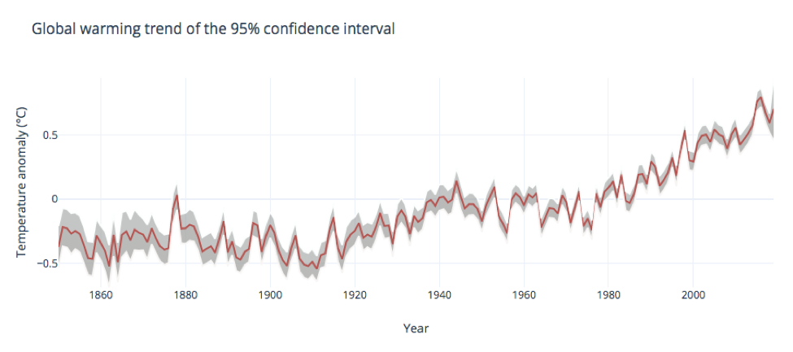

# Global warming visualization project

##  Literature research


The framework is based on the article published in 2013, Stephanie and Chris focus on two main concepts that work from models of cognition to support meaningful data visualizations— simplification and emphasis. [@Steph]

```
@misc{Steph,
  author = {{Evergreen, Stephanie;Metzner, Chris}},
  year = {2013},
  title = {Design Principles for Data Visualization in Evaluation},
  howpublished = {Academic Journal}},
  note = {Vol.2013 Issue 140,p5-20,16p}
}

```
Simplification helps readers focus on the data, for color, it means the number of the color should be simplified. Instead of using different colors, secondary information or data points should be simplified to a shade of gray so that chosen elements can appropriately stand out[@Steph].The same with shape and texture, a good visualization work won’t use too much chart junk or add unnecessary charts[@Emma].And space should be distributed evenly[@Anderson].

```
@misc{Emma,
  author = {{Emma Perk,Lyssa Wilson Becho}},
  year = {2019},
  title = {DO's and Don'ts-Basic Principles of Data Visualization},
  howpublished = {\url{http://www.evalu-ate.org/wp-content/uploads/formidable/14/Dos-and-Donts-Handout-FCRD.pdf}},
  note = {Accessed: 2019-04-12}
}

```
```
@misc{Anderson,
  author = {{Anderson, Melissa}},
  year = {2017},
  title = {Data Visualization and the 9 Fundamental Design Principles},
  howpublished = {\url{https://www.idashboards.com/blog/2017/07/26/data-visualization-and-the-9-fundamental-design-principles/}},
  note = {Accessed: 2019-04-12}
}

```

A simplify visualization should fit one page for better reading and fit for a mobile device as well, because of the popularity of smartphone[@Mico]. 

```
@misc{Mico,
  author = {{Mico Yuk, Stephanie Diamond}},
  year = {2014},
  title = {EVALUATING DATA VISUALIZATIONS},
  howpublished = {\url{https://www.dummies.com/programming/big-data/big-data-visualization/evaluating-data-visualizations/}},
  note = {Accessed: 2019-04-12}
}

```

The second key criteria is emphasis. It also includes two metrics: Basic Design and Movement. In basic design metrics, the color should be chosen wisely. For example, yellow is a good example of a popular color choice when a designer needs to call attention to a specific area. However, certain color combinations, such as red–green or blue– yellow, cause difficulty for people with color blindness and should generally be avoided[@Evergreen]; And data-ink ratio, data-density was called by Tufte[@Tufte] Weight requests your visualization have difference in weight ratio, such as changing the size of some points in a scatter plot. The movement includes story line and animation/filters, they are good practices to draw the reader’s attention. 
 
 ```
@misc{Tufte,
  author = {{Tufte}},
  year = {2001},
  title = {The Visual Display of Quantitative Information},
  howpublished = {Book}},
  note = {Accessed: 2019-04-12}
}

```

My framework is based on this article from Stephanie and Chris. And considering the important role that communication plays in visualization, I also included it to the key criteria. In Jennifer’s blog(2018)[@Jennifer], the three questions below have been raised:

1.	What is the goal of the document?
2.	Who is the audience?
3.	What are the most effective ways to display and group the data?

```
@misc{Jennifer,
  author = {{Jennifer Bellville}},
  year = {2018},
  title = {Blog: Summarizing Project Milestones},
  howpublished = {\url{http://www.evalu-ate.org/blog/bellville_mar18/}},
  note = {Accessed: 2019-04-12}
}

```

The goal for visualization accurately show the data without misrepresenting. This is very essential for communication. And you should choose the best chart to reach this goal. (Emma Perk & Lyssa Wilson Becho, 2019). And your visualization should be audience-friendly, which means it is easy understanding and specific to your audience[@Emma]. 

## The framework

Key Criteria | Metrics | Description | Max Points
------------ | ------------- |------------- |-------------
Simplification | Basic Design | Color number(1),shape(1),texture(1),space(1) | 4
--- | Fitness | Fit one page(1); Fit for mobile(1) | 2
Emplasis | Basic Design | Color choice(1), weight(1), data-ink ratio(1), data-density(1) | 4
--- | Movement | Story line(1), animation/filters(1) | 2
 Communication | Goal | Accurately show the data(2); Choose the best chart(2) | 4
--- | Audience | Involved-- Specific to your audience(1);Easy understanding(1) |2 
 
## Evaluate five charts

1. 


[Pic1](https://www.ipcc.ch/site/assets/uploads/2018/02/WG1AR5_SPM_FINAL.pdf)

Key Criteria | Metrics | Description | Max Points
------------ | ------------- |------------- |-------------
Simplification | Basic Design | Color number(1),shape(1),texture(1),space(1) | 3
--- | Fitness | Fit one page(1); Fit for mobile(1) | 1
Emplasis | Basic Design | Color choice(1), weight(1), data-ink ratio(1), data-density(1) | 4
--- | Movement | Story line(1), animation/filters(1) | 0
 Communication | Goal | Accurately show the data(2); Choose the best chart(2) | 4
--- | Audience | Involved-- Specific to your audience(1);Easy understanding(1) |2 

Conclusion : (14 out of 18)This chart provided good evidence for the effect of human activates, the emission-based RF of a compound can be reported, which provides a more direct link to human activities.And the last row was applied on a grey background with a red bar, which is very stand out. The important data is also emphasized. 
The problem is too many colors are used, and data was not ordered and hard to follow. 

2.


[Pic2](https://www.ipcc.ch/site/assets/uploads/2018/02/WG1AR5_SPM_FINAL.pdf)

Key Criteria | Metrics | Description | Max Points
------------ | ------------- |------------- |-------------
Simplification | Basic Design | Color number(1),shape(1),texture(1),space(1) | 4
--- | Fitness | Fit one page(1); Fit for mobile(1) | 1
Emplasis | Basic Design | Color choice(1), weight(1), data-ink ratio(1), data-density(1) | 4
--- | Movement | Story line(1), animation/filters(1) | 2
 Communication | Goal | Accurately show the data(2); Choose the best chart(2) | 4
--- | Audience | Involved-- Specific to your audience(1);Easy understanding(1) |2 

Conclusion : (17 out of 18) This graph is very nice to show the difference in the impact of natural and human activities. And it is clear that human activities play an important role in global warming. Color is wisely used in this case. And it is easy understanding. It will be perfect if the graph has some interactive functions.

3.


[Pic3](https://www.carbonbrief.org/qa-how-do-climate-models-work)

Key Criteria | Metrics | Description | Max Points
------------ | ------------- |------------- |-------------
Simplification | Basic Design | Color number(1),shape(1),texture(1),space(1) | 3
--- | Fitness | Fit one page(1); Fit for mobile(1) | 2
Emplasis | Basic Design | Color choice(1), weight(1), data-ink ratio(1), data-density(1) | 4
--- | Movement | Story line(1), animation/filters(1) | 1
 Communication | Goal | Accurately show the data(2); Choose the best chart(2) | 4
--- | Audience | Involved-- Specific to your audience(1);Easy understanding(1) |1 

Conclusion : (15 out of 18)This graph shows the trend of global warming, and it reached the goal. The graph is very clear and has a high data-ink ratio and good data-density. And the filters can let readers choose what they are interested. 
The problem are: 1.The title is not included in the graph; 2.Dash line is not included in the legend; 3. Need more information for the legends for better understanding.

4. 


[Pic4](https://www.ucsusa.org/global-warming/science-and-impacts/science/human-contribution-to-gw-faq.html)

Key Criteria | Metrics | Description | Max Points
------------ | ------------- |------------- |-------------
Simplification | Basic Design | Color number(1),shape(1),texture(1),space(1) | 3
--- | Fitness | Fit one page(1); Fit for mobile(1) | 2
Emplasis | Basic Design | Color choice(1), weight(1), data-ink ratio(1), data-density(1) | 3
--- | Movement | Story line(1), animation/filters(1) | 0
 Communication | Goal | Accurately show the data(2); Choose the best chart(2) | 2
--- | Audience | Involved-- Specific to your audience(1);Easy understanding(1) |1 

Conclusion : (11 out of 18) From the article, this graph want to show a direct Evidence of Fossil Fuel Derived CO2 in the Atmosphere. While the concentration of carbon has increased, the carbon originating from natural sources has decreased.But it is lack of necessary axis and title, thus it is confused. It do have a good weight of data but the grid is unnecessary in this case.
Also, some lines are cut off so we don’t know whether it shows the data accurately.

5.


[pic5](https://en.wikipedia.org/wiki/Global_warming_controversy)

Key Criteria | Metrics | Description | Max Points
------------ | ------------- |------------- |-------------
Simplification | Basic Design | Color number(1),shape(1),texture(1),space(1) | 4
--- | Fitness | Fit one page(1); Fit for mobile(1) | 2
Emplasis | Basic Design | Color choice(1), weight(1), data-ink ratio(1), data-density(1) | 2
--- | Movement | Story line(1), animation/filters(1) | 0
 Communication | Goal | Accurately show the data(2); Choose the best chart(2) | 1
--- | Audience | Involved-- Specific to your audience(1);Easy understanding(1) |1 


Conclusion : (10 out of 18) The graph is well structured and include the necessary title, legends and arises. But it contains too much data in such a small area and the daily irradiance can’t show any important information here. Also, although we can tell that there are solar circle variations exist, it didn’t show the relationship for global warming, the evidence is weak for global warming controversy.

 ## My visualizations
 
 
  1. Replicate the warming strips
 


This graph is made by Tableau, and which strip represent a year's temperature anomaly. And it is interactive.

2. Global warming trend (by Tableau)


3. Global warming trend comparing different areas(by Ploty)


4. Global warming trend of the 95% confidence interval(by Ploty)

